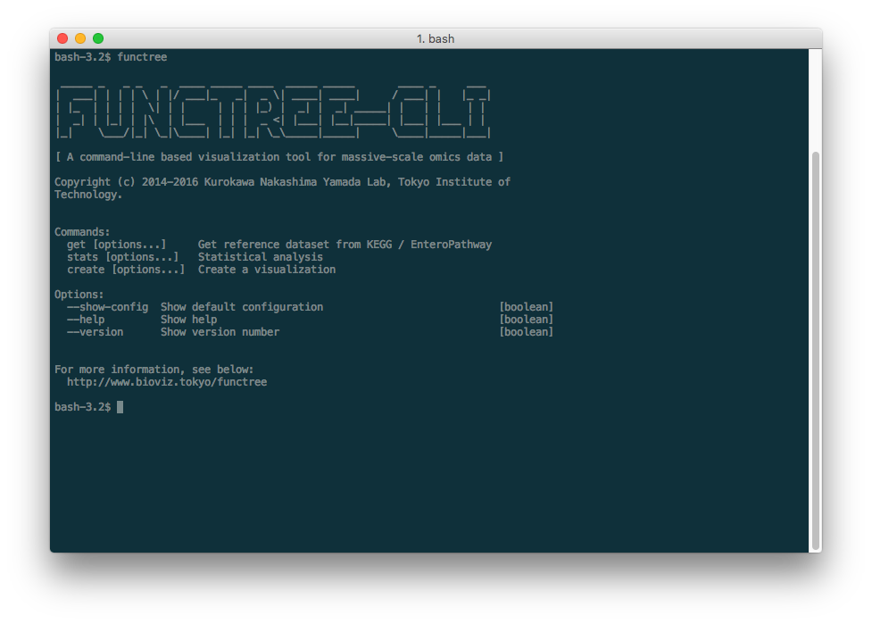

# functree-cli


## Description
**functree-cli** is a command-line tool, which allows user to visualize, customize, and compute statistical test to understand the biological functionality of their omics data. functree-cli allows user to map their omics data on to a pre-defined treemap, which is based on the [KEGG BRITE](http://www.genome.jp/kegg/brite.html) or [EnteroPathway](http://www.enteropathway.org/) database. This allows user to quickly and comprehensively understand the functional potential of their data, and to develop further hypothesis and scientific insights.



## Requirements
- [Node.js](https://github.com/nodejs/node) >= v4.6.1
- [Python](https://www.python.org/) >= v3.5.1
  - [SciPy](https://github.com/scipy/scipy)
  - [NumPy](https://github.com/numpy/numpy)
  - [Pandas](https://github.com/pandas-dev/pandas)

## Installation
Clone this repository:
```
$ git clone http://tsubaki.bio.titech.ac.jp/yyamate/functree-cli.git
```
Enter `functree-cli` directory:
```
$ cd ./functree-cli
```
Install functree-cli to your system using [npm](https://www.npmjs.com):
```
$ npm install -g
```

## Usage
### Overview
Basic usage on CLI is below:
```
$ functree [command] [options...]
```
| Command / Option | Description |
|:--|:--|
| get [options...] | Get reference data from KEGG |
| stats [options...] | Statistical analysis |
| create [options...] | Create a visualization |
| --show-config | Show default configuration |
| --help | Show help |
| --version | Show version number |

### Getting reference data from KEGG
Before creating a visualization, you need to prepare reference data for data mapping.

functree-cli provides the simple way to get reference data from [KEGG BRITE](http://www.genome.jp/kegg/brite.html) in following command.
```
$ functree get -d kegg -o kegg.json
```
Alternatively, you can use original reference data. It must be JSON format and have the structure corresponded to following example. You can also refer to [flare.json](https://gist.github.com/mbostock/1093025).
```
{
  "name": "WWW",
  "label": "World Wide Web",
  "depth": 0,
  "children": [
    {
      "name": "google.com",
      "label": "Google",
      "depth": 1,
      "children": [
        {
          "name": "mail.google.com",
          "label": "Gmail",
          "depth": 2
        },
        {
          "name": "maps.google.com",
          "label": "Google Maps",
          "depth": 2
        }
      ]
    }
  ]
}
```

### Statistical analysis
:warning: This section is currently under construction.

```
$ functree stats -d kegg.json -m average -i ko_abundance.tsv -o functree_abundance.tsv
```

| Identifier | GNU-style | Description |
|:--|:--|:--|
| -i | --input | Specify input file |
| -o | --output | Specify output file |
| -d | --database | Specify reference database |
| -m | --method | Specify analysis method |
| -c | --config| Specify configuration file |

### Creating a visualization
:warning: This section is currently under construction.

```
$ functree create -d kegg.json -i functree_abundance.tsv -o functree_visualization.html -f html
```

| Identifier | GNU-style | Description |
|:--|:--|:--|:--|
| -t | --theme | Specify visualization theme
| -i | --input | Specify input file |
| -o | --output | Specify output file |
| -d | --database | Specify reference database |
| -f | --format | Specify output format |
| -c | --config | Specify configuration file |

## Building
1. Clone this repository.
1. Run `npm install` to install the dependencies.
1. Run `npm run build` to compile the ES6 codes (`src/*.js`).


## Reference
- Uchiyama T, Irie M, Mori H, Kurokawa K, Yamada T. FuncTree: Functional Analysis and Visualization for Large-Scale Omics Data. PLoS One. 2015 May 14;10(5):e0126967. doi: 10.1371/journal.pone.0126967. eCollection 2015. PubMed PMID: 25974630; PubMed Central PMCID: PMC4431737.

## License
See `LICENSE` file.
